# 📂 AWS Infrastructure Images

## VPC
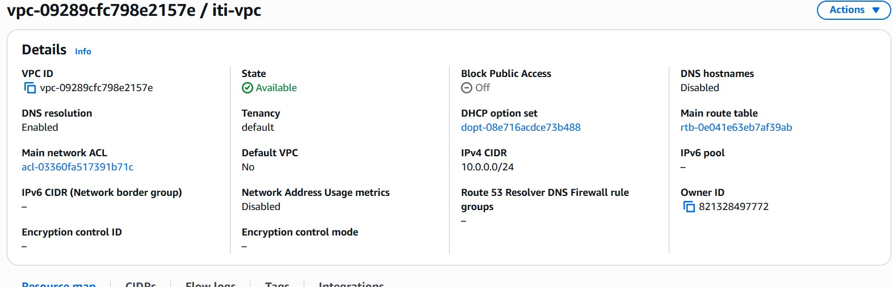

---

## VPC Details
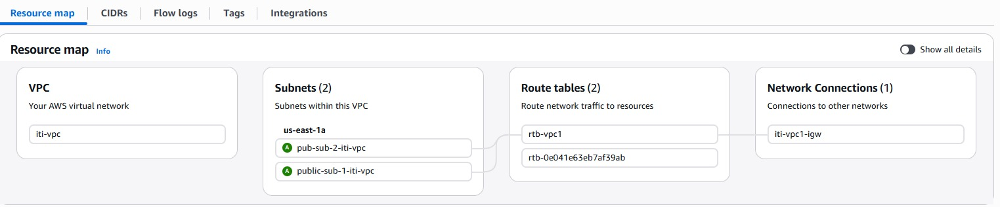

---

## Subnets
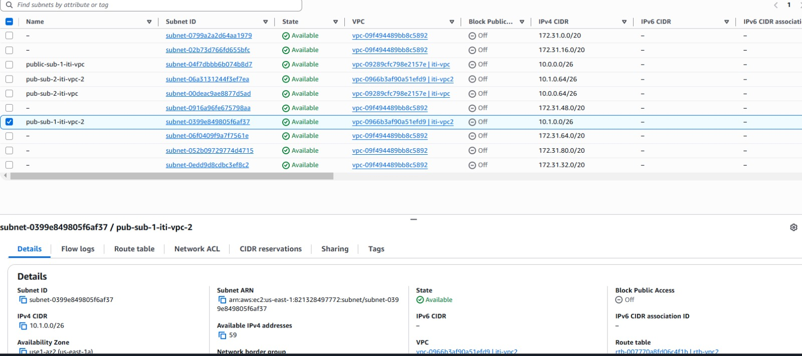

---

## Route Tables
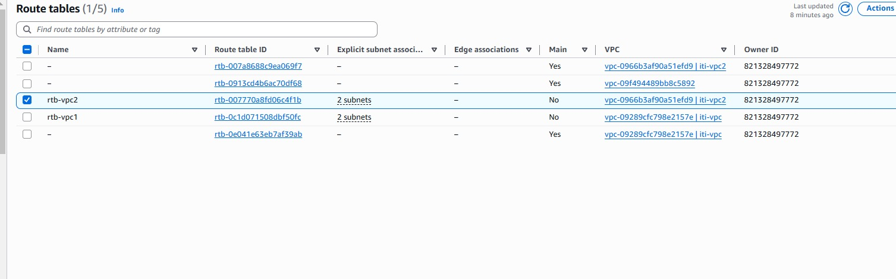

---

## Gateways
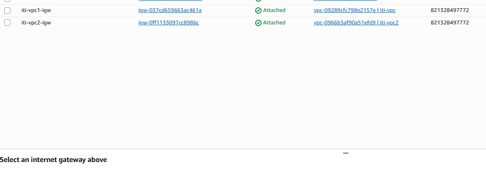

---

## EC2 Instance
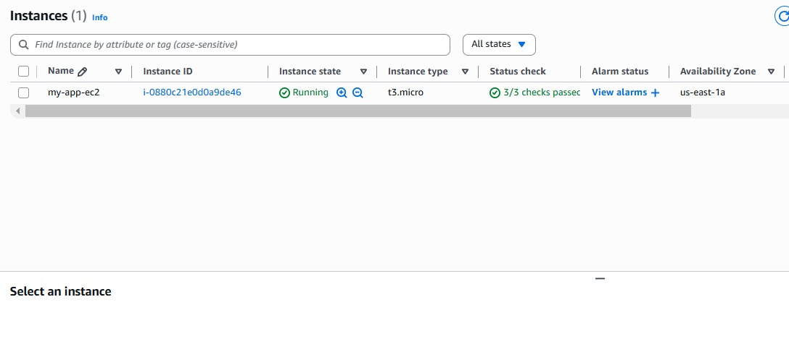

---

## Security Group - Allow Port 80
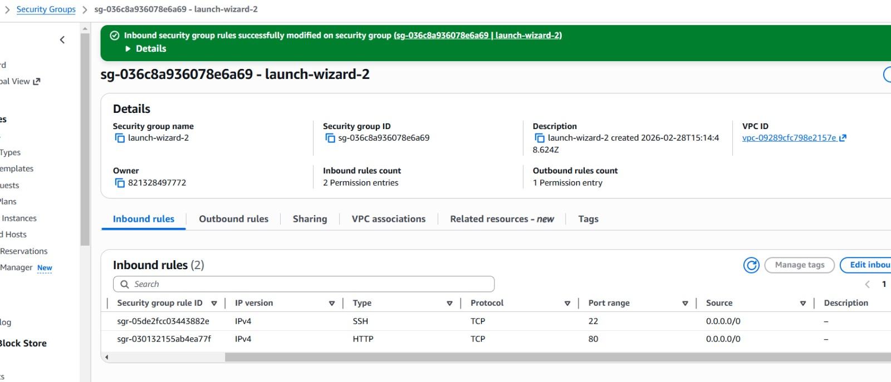

---

## SSH Access
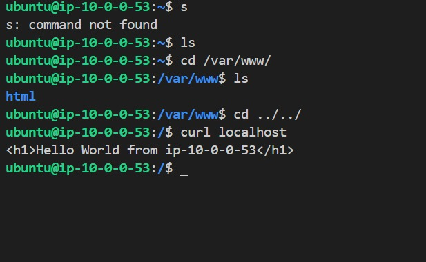

---

## VPC Peering
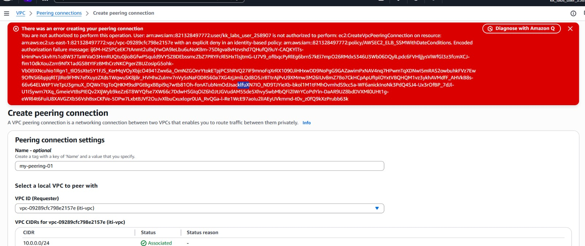

---
 
## Request From Browser
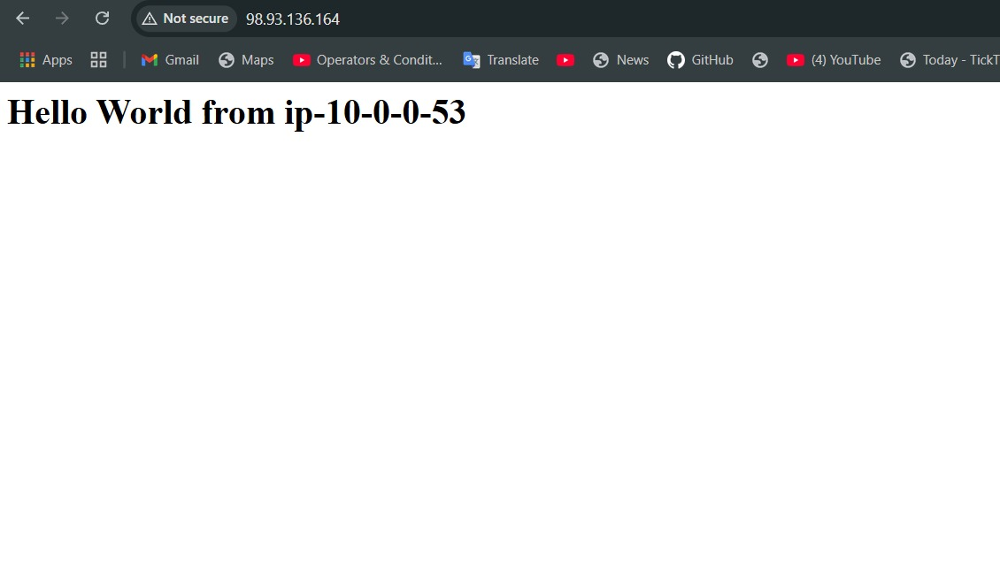

---

## Additional Diagram
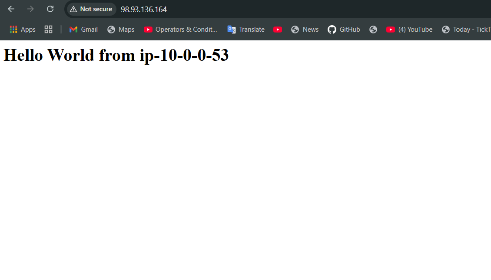